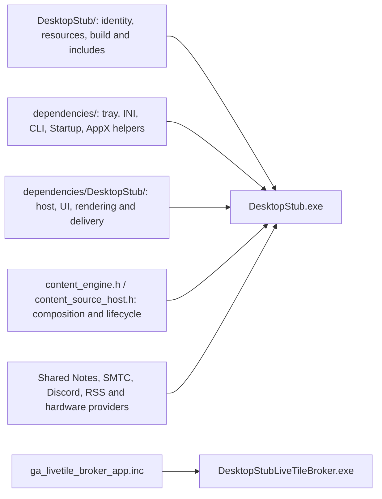

# DesktopStub topology

Verified against the source at `53d9e32` on 2026-10-03. The source engine is
built into the host; there is no external plugin DLL loading interface yet.

## Build-time composition

[`DesktopStub.cpp`](../DesktopStub/DesktopStub.cpp) includes ordered C++ source
fragments. [`BuildDesktopStub.cmd`](../DesktopStub/BuildDesktopStub.cmd) also
compiles Discord and, by default, ASUS implementation objects and links them
into the host. These object files and source folders are build inputs, not
runtime plugins. The compiled host does not need the `dependencies` source
directory beside it.

`dependencies/DesktopStub` still contains substantial product-specific code
and globals. Shared mechanisms have been extracted, but physical relocation
does not mean the entire application has reached the final overlay design.

## Runtime files

| File | Purpose |
| --- | --- |
| `DesktopStub.exe` | Tray/configuration, source scheduling, composition, rendering and delivery; built-in provider code. |
| `DesktopStubLiveTileBroker.exe` | Separately built packaged WinRT helper, primarily for Windows 8/8.1 tile delivery. Included in the normal build. |
| `DesktopStub.ini` | Product configuration, normally beside the host; an explicit custom INI path is supported. |
| `AppxManifest.xml`, `Assets/` | Generated registration metadata and tile images when those features are used. |
| `DesktopStubAppxStub.exe` | Compatibility activation helper for the relevant legacy package path. The current implementation copies the host executable under this name; it is not a lean separate plugin. The broker path checks for its separately built broker instead. |
| `DesktopStubLiveTileTask.dll` | Disabled experimental background-task path. Source remains, but the normal build does not produce this DLL. |

Renamed product copies derive their helper names and identity from the product
configuration. The table uses the default DesktopStub names. OS libraries
remain ordinary Windows runtime dependencies.

## Content sources

The canonical catalog is in [`content_engine.h`](../dependencies/content_engine.h):

- Background: desktop wallpaper, live wallpaper capture, custom image, or solid
  color.
- Text/data: custom text, RSS/Atom, Caps Lock state, SMTC, Notes, Discord Rich
  Presence, CapsBlink, and AsusBlink.
- Up to 32 entries can each combine a background and ordered text/data sources.
  Refresh timing, cycling and Auto/Overlay/Off text presentation belong to the
  host.

The legacy Wallpaper/RSS choice is a preset. RSS can appear over wallpaper;
selecting it does not imply that the wallpaper feature has been removed.
See [the content guide](content-engine.md) for configuration and remaining UI
limitations.

Notes uses `dependencies/content_sources/notes.inc` directly. DesktopStub does
not load `RealTimeNotesDeskband.dll`. The retained standalone deskband is a
separate Explorer COM product sharing that data engine. The other remaining
standalone products likewise remain until their required behavior has parity;
their presence is not evidence of a DLL plugin architecture.

The standard host includes hardware code, but the hardware actions default
off. `DESKTOPSTUB_ENABLE_HARDWARE_SOURCES=0` can omit those backends at build
time; this is an existing build boundary, not a finding about the Defender
detection.

## Current direction

The user's preference is to preserve the current portable layout and introduce
compiled source DLLs only if the detection investigation establishes a need.
No provider was converted to a DLL during this investigation. Detection logs
identify an executable and classification, not a responsible C++ module; they
do not currently justify a DLL split. The detection remains under investigation
in [the incident record](audit-defender-detection.md).
